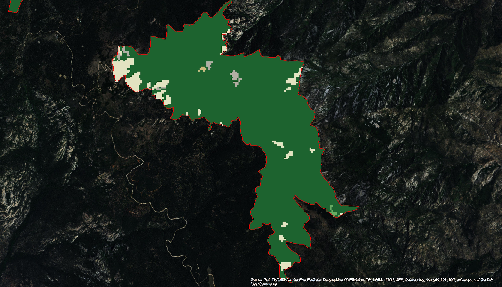
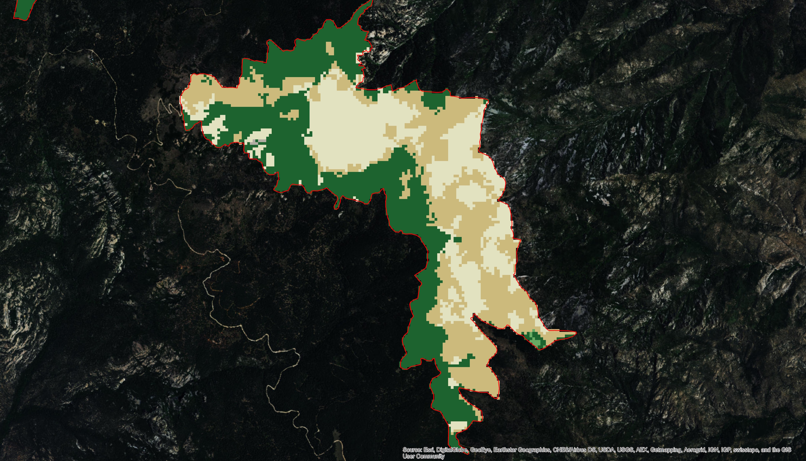

```{r setup, include = FALSE}
library(ch.first.pass)
library(dplyr)
library(plotly)
library(stringr)
library(viridis)
data("all_sp")
all_sp <- dplyr::select(all_sp, -from_to, -Count)
# vignette: >
#   %\VignetteIndexEntry{Vignette Title}
#   %\VignetteEngine{knitr::rmarkdown}
#   %\VignetteEncoding{UTF-8}
```

## Abstract

TBD

## Introduction

TBD

#### Mount Graham red squirrel habitats in 2001 (top) and in 2011 (bottom) after the large wildfires of 2004.

Green is evergreen forest; tan and whitish are shrub/scrub and grassland.


<br>
<br>


<hr>

#### Least Bell's Vireo habitat in CH in 2001 (top), 2011 (middle), and the change in habitats from 2001-2011.

Reds are classified as development of varying intensity; shades of brown and gray are 'natural' habitat.


<br>
<br>

<br>
<br>


## Methods

### Species selection

### NLCD

## Results

TBD

### _Species_

```{r one, echo=FALSE, fig.width=7, fig.height=7, warning=FALSE}
no_chg <- filter(all_sp, from == to)
change <- filter(all_sp, from != to)

chg_by_sp <- tapply(change$Acres,
                    INDEX = change$Species,
                    FUN = sum, na.rm = TRUE)
sme_by_sp <- tapply(no_chg$Acres,
                    INDEX = no_chg$Species,
                    FUN = sum, na.rm = TRUE)

# And set up the data frame...
by_spp <- data.frame(Species = names(chg_by_sp),
                     chg_by_sp = as.vector(chg_by_sp))
tmp_sp <- data.frame(Species = names(sme_by_sp),
                     sme_by_sp = as.vector(sme_by_sp))
by_spp <- full_join(by_spp, tmp_sp, by = "Species")
by_spp$sp_total <- by_spp$chg_by_sp + by_spp$sme_by_sp
by_spp$chg_pct <- (by_spp$chg_by_sp / by_spp$sp_total) * 100
by_spp <- arrange(by_spp, desc(chg_pct))
```

The percentage of critical habitat that changed from one NLCD class to another ranged from `r round(min(by_spp$chg_pct, na.rm = TRUE), digits = 1)` to `r round(max(by_spp$chg_pct, na.rm = TRUE), digits = 1)` per species. The average amount of change was `r round(mean(by_spp$chg_pct, na.rm = TRUE), digits = 1)`% (median = `r round(median(by_spp$chg_pct, na.rm = TRUE), digits = 1)`%).

```{r two, echo=FALSE, fig.width=7, fig.height=7, warning=FALSE}
plot_a <- plot_ly(data = by_spp,
                  x = by_spp$Species,
                  y = by_spp$chg_pct, 
                  type = "bar",
                  marker = list(color = substr(viridis(1), 0, 7))) %>%
          layout(xaxis = list(title = "", tickangle = 60), 
                 yaxis = list(title = "% CH changed"), 
                 margin = list(b = 160))

plot_b <- plot_ly(by_spp,
                  x = by_spp$Species,
                  y = by_spp$chg_by_sp, 
                  type = "bar",
                  marker = list(color = substr(viridis(1), 0, 7))) %>%
          layout(xaxis = list(title = "", tickangle = 60), 
                 yaxis = list(title = "CH changed (acres)"), 
                 margin = list(b = 160))

# subplot(plot_a, plot_b, margin = 0.05, nrows = 2) %>% 
#     layout(title = "CH changes by percent (top) and area (bottom)", 
#            showlegend = FALSE)
htmltools::tagList(list(plot_a, plot_b))
```

The proportions of habitat transitions varies by species. For example, the Mt. Graham red squirrel had the largest proportion of its habitat change, primarily because of a [[year]] fire

```{r sp_squirrel, echo=FALSE, fig.width=7, fig.height=7, warning=FALSE}
make_heatmap(all_sp, "MountGrahamRedSquirrel", "MountGrahamRedSquirrel")
```

Whooping crane, which saw 3%, or >11,000 acres, of habitat change within critical habitat:

```{r sp_whcr, echo=FALSE, fig.width=7, fig.height=7, warning=FALSE}
make_heatmap(all_sp, "WhoopingCrane", "WhoopingCrane")
```


### _Habitats_

We next asked if there were systematic habitat transitions across species. MORE

```{r three, echo=FALSE, fig.width=7, fig.height=7, warning=FALSE}
all_hab <- tapply(all_sp$Acres,
                  INDEX = all_sp$from,
                  FUN = sum, na.rm = TRUE)
chg_fr_hb <- tapply(change$Acres,
                    INDEX = change$from,
                    FUN = function(x) -sum(x, na.rm = TRUE))
chg_to_hb <- tapply(change$Acres,
                    INDEX = change$to,
                    FUN = sum, na.rm = TRUE)

# And set up the data frame...
tot_hab <- data.frame(habitat = names(all_hab),
                      tot_hab = as.vector(all_hab))
by_hab <- data.frame(habitat = names(chg_to_hb),
                     chg_to_hb = as.vector(chg_to_hb))
tmp_hb <- data.frame(habitat = names(chg_fr_hb),
                     chg_fr_hb = as.vector(chg_fr_hb))
by_hab <- full_join(by_hab, tmp_hb, by = "habitat")
by_hab <- full_join(by_hab, tot_hab, by = "habitat")
by_hab$net_chg <- by_hab$chg_fr_hb + by_hab$chg_to_hb
by_hab$chg_pct <- (by_hab$net_chg / by_hab$tot_hab) * 100
by_hab <- arrange(by_hab, desc(chg_pct))
```

```{r four, echo=FALSE, fig.width=7, fig.height=7, warning=FALSE}

plot_a <- plot_ly(by_hab,
                  x = by_hab$habitat,
                  y = by_hab$chg_pct, 
                  type = "bar",
                  marker = list(color = substr(viridis(1), 0, 7))) %>%
          layout(xaxis = list(title = "", tickangle = 60), 
                 yaxis = list(title = "% CH changed"), 
                 margin = list(b = 160))

plot_b <- plot_ly(by_hab,
                  x = by_hab$habitat,
                  y = by_hab$net_chg, 
                  type = "bar",
                  marker = list(color = substr(viridis(1), 0, 7))) %>%
          layout(xaxis = list(title = "", tickangle = 60), 
                 yaxis = list(title = "CH changed (acres)"), 
                 margin = list(b = 160))

# subplot(plot_a, plot_b, margin = 0.05, nrows = 2) %>% 
#     layout(title = "CH changes by percent (top) and area (bottom)", 
#            showlegend = FALSE)
htmltools::tagList(list(plot_a, plot_b))

```

To see which habitat was converted to which habitat, we can create a heatmap. Note that the acres are log10-transformed because the area of `shrub/scrub` is so large relative to other areas:

```{r five, echo=FALSE, fig.width=7, fig.height=7, warning=FALSE}
make_heatmap(all_sp, "", "All species")
```

## Appendix

To facilitate species-by-species evaluation of habitat changes, we provide 'from:to' heatmaps for each of the 42 species in the dataset:

```{r appendix_spp, echo=FALSE, fig.width=7, fig.height=210, warning=FALSE}
plots <- list()
un_sp <- unique(all_sp$Species)
for(i in 1:length(un_sp)) {
  plots[[i]] <- make_heatmap(all_sp,
                             species = un_sp[i],
                             title = un_sp[i],
                             height = 600)
}
htmltools::tagList(plots)
```

