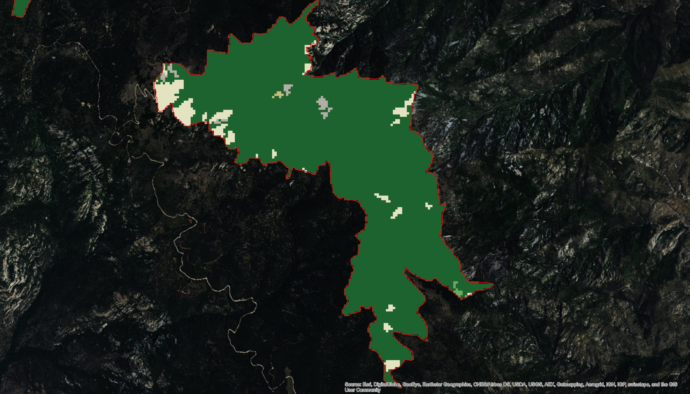

We provide two examples of the intersection of the National Land Cover Database 
(NLCD) and designated critical habitat. The first example shows how NLCD vegetation
categories changed (dramatically) between 2001 and 2011 as a result of a 2004 
wildfire. The second example shows a small piece of a complex landscape in
which critical habitat has been designated, with widespread, small changes of 
habitat scattered throughout the area.

### Example 1: Mount Graham red squirrel

Mount Graham red squirrel habitats in 2001 (top) and in 2011 (bottom) after the large wildfires of 2004. Green is evergreen forest; tan and whitish are shrub/scrub and grassland.

 
 

### Example 2: Least Bell's Vireo

Least Bell's Vireo habitat in CH in 2001 (top), 2011 (middle), and the change in habitats from 2001-2011 (bottom). Reds are classified as development of varying intensity; shades of brown and
gray are 'natural' habitat.

 
 

 
 

